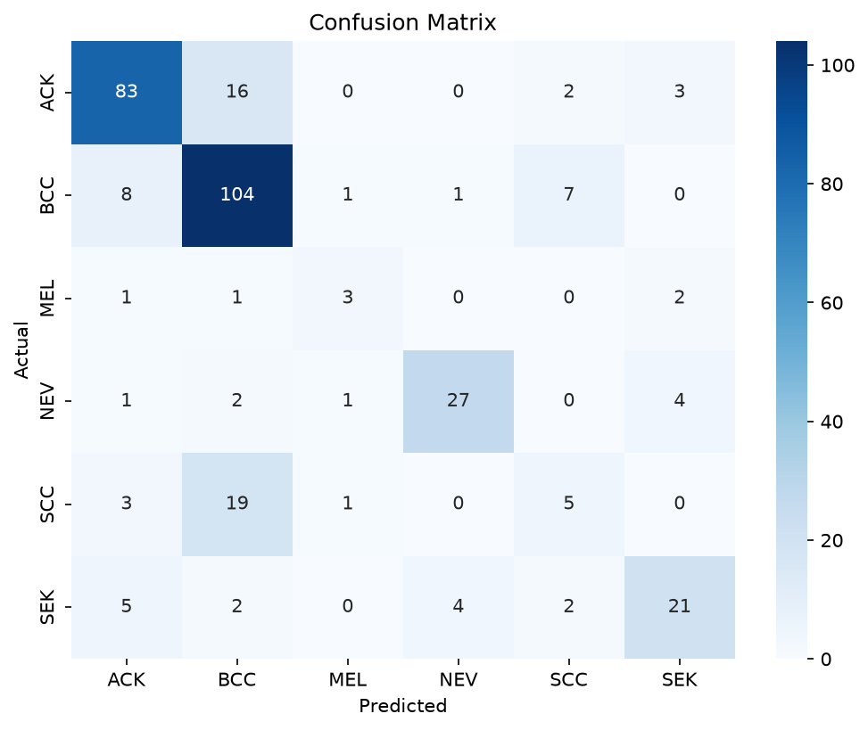
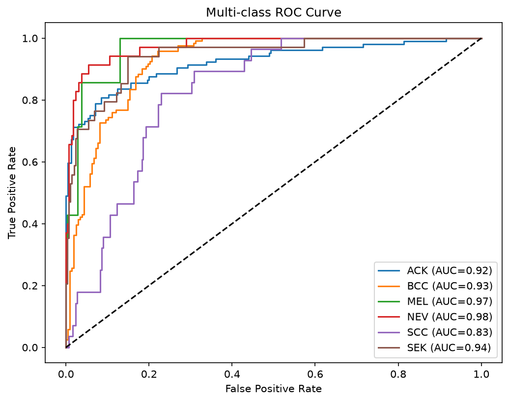

# Skin Cancer Detection Using Fusion Deep Learning

A deep learning framework for automated **multi-class skin cancer classification** using clinical skin images and patient clinical information.

The proposed model combines **EfficientNetB3**, **Gray-World Color Constancy**, and **Squeeze-and-Excitation (SE) Attention** to improve classification performance on the **PAD-UFES-20** dataset. The model is evaluated using **patient-level stratified 5-fold cross-validation** with ensemble prediction to prevent data leakage and provide reliable performance estimates.

---

# Project Poster

> Click the poster below to view the full PDF.

[](poster/skin_cancer_poster.pdf)

---

# Features

- EfficientNetB3 transfer learning
- Gray-World color constancy preprocessing
- Fusion of image features and clinical metadata
- Squeeze-and-Excitation (SE) Attention
- Patient-level stratified 5-fold cross-validation
- Ensemble prediction
- Class imbalance handling using weighted loss
- Early stopping and learning rate scheduling
- Performance evaluation using ROC curves and confusion matrix

---

# Dataset

This project uses the **PAD-UFES-20** skin cancer dataset.

## Dataset Summary

- **2,298** smartphone-acquired clinical images
- **1,373** patients
- **1,641** unique lesions
- **6** diagnostic categories

| Class | Images |
|--------|-------:|
| Basal Cell Carcinoma (BCC) | 845 |
| Actinic Keratosis (ACK) | 730 |
| Nevus (NEV) | 244 |
| Seborrheic Keratosis (SEK) | 235 |
| Squamous Cell Carcinoma (SCC) | 192 |
| Melanoma (MEL) | 52 |

The original dataset is available on Kaggle:

https://www.kaggle.com/datasets/mahdavi1202/skin-cancer

> **Note:** Clinical images are **not included** in this repository because of their large size. Only the metadata file required to run the project is provided.

---

# Model Architecture

The proposed framework consists of two branches.

## Image Branch

- Gray-World Color Constancy
- EfficientNetB3 backbone
- Squeeze-and-Excitation (SE) Attention
- Deep image feature extraction

## Clinical Branch

- Patient clinical metadata
- Fully connected neural network
- Clinical feature embedding

## Feature Fusion

- Feature concatenation
- SE Attention
- Fully connected classifier
- Softmax output layer for six skin lesion classes

---

# Training Strategy

- Transfer learning with EfficientNetB3
- Fine-tuning of upper network layers
- Patient-level Stratified Group 5-Fold Cross Validation
- Label smoothing
- Class-weighted loss
- Early stopping
- Learning rate reduction
- Ensemble averaging across the five trained fold models

---

# Results

## Overall Performance

| Metric | Score |
|--------|-------|
| Accuracy | **73.86%** |
| Weighted Precision | **72.47%** |
| Weighted Recall | **73.86%** |
| Weighted F1-score | **72.74%** |
| Macro F1-score | **62.43%** |

## Per-class Performance

| Class | Precision | Recall | F1-score |
|------|---------:|-------:|---------:|
| ACK | 0.82 | 0.80 | 0.81 |
| BCC | 0.72 | 0.86 | 0.78 |
| MEL | 0.50 | 0.43 | 0.46 |
| NEV | 0.84 | 0.77 | 0.81 |
| SCC | 0.31 | 0.18 | 0.23 |
| SEK | 0.70 | 0.62 | 0.66 |

---

## Confusion Matrix



---

## ROC Curve



---

# Repository Structure

```text
skin_cancer_detection/
│
├── README.md
├── LICENSE
│
├── data/
│   └── metadata.csv
│
├── notebooks/
│   └── skin_cancer_detection_model.ipynb
│
├── poster/
│   ├── skin_cancer_poster.pdf
│   └── skin_cancer_poster.png
│
├── research_paper/
│   └── skin_cancer_research_paper.pdf
│
└── results/
    ├── confusion_matrix.png
    ├── roc_curve.png
    ├── classification_report.txt
    └── final_metrics.csv
```

---

# Running the Project

1. Download the PAD-UFES-20 dataset from Kaggle.
2. Extract the dataset.
3. Place the dataset inside the `data/` directory.
4. Open:

```text
notebooks/skin_cancer_detection_model.ipynb
```

5. Update the dataset paths if necessary.
6. Run all notebook cells sequentially.

---

# Research Paper

The complete research paper describing the proposed methodology and experimental evaluation is available in:

```text
research_paper/
```

---

# Poster

The project poster summarizing the methodology and experimental results is available in:

```text
poster/
```

---

# Results

The evaluation outputs are available in:

```text
results/
```

Including:

- Confusion Matrix
- ROC Curve
- Classification Report
- Final Evaluation Metrics

---

# Technologies Used

- Python
- TensorFlow
- Keras
- EfficientNetB3
- Scikit-learn
- Pandas
- NumPy
- Matplotlib
- OpenCV
- Jupyter Notebook

---

# Dataset

This project uses the **PAD-UFES-20** dataset.

Original dataset:

https://www.kaggle.com/datasets/mahdavi1202/skin-cancer

---

# Notes

- Clinical images are **not included** in this repository because of their large size.
- Only the metadata file and project source code are included.
- Please download the original dataset from Kaggle before running the notebook.

---

# Citation

If you use this repository in your research or academic work, please cite the original **PAD-UFES-20** dataset and the corresponding publication.

---

# License

This project is distributed under the **MIT License**. See the `LICENSE` file for more details.

---

# Author

**Abdulrahman Alharbi**
